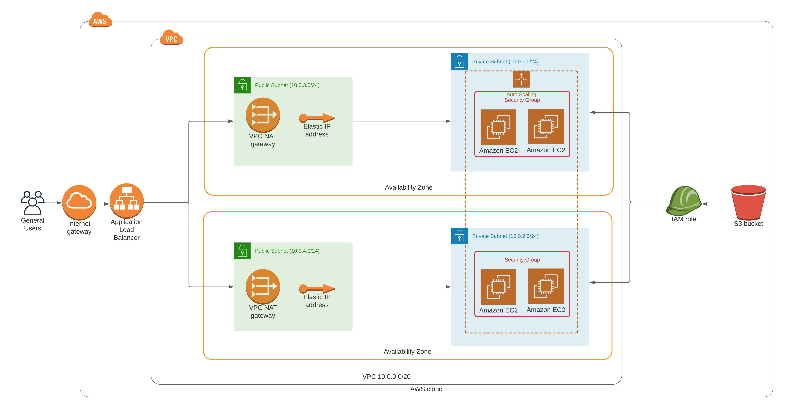

# Deploy a high-availability web app using CloudFormation
This project is about deploying a high-available web app using Infrastructure as Code (IaC) with [AWS Cloudformation](https://aws.amazon.com/cloudformation/) scripts.

## Project Overview
Assume that your company is creating an Instagram clone called Udagram. Developers pushed the latest version of their code in a zip file located in a public S3 Bucket.

You have been tasked with deploying the application, along with the necessary supporting software into its matching infrastructure.

This needs to be done in an automated fashion so that the infrastructure can be discarded as soon as the testing team finishes their tests and gathers their results.

### Project Files
```bash
├── architecture # Folder holding architecture diagram
│   └── architecture_diagram.png
├── infrastructure # Folder holding IaC automation scripts
│   ├── network-params.json
│   ├── network.yml
│   ├── run.sh
│   ├── server-params.json
│   └── servers.yml
└── website # Folder holding dummy website and script to upload website archive to S3 bucket
    ├── index.html
    └── upload.sh
```

### Project Setup

#### Check architecture overview


#### Create project
1. Create website package and upload to S3 bucket
    ```bash
    cd website
    ./upload.sh # Please note that S3 bucket name is hardcoded in script
    cd ..
    ```
2. Create network infrastructure
    ```bash
    cd infrastructure
    stack=network ./run.sh create
    cd ..
    ```
3. Create servers infrastructure
    ```bash
    cd infrastructure
    stack=servers ./run.sh create
    cd ..
    ```
4. Once all stacks are created, you can go to [AWS Cloudformation stacks](https://console.aws.amazon.com/cloudformation/home?region=us-east-1#/stacks) page, and check URL of the Loadbalancer in output section of *udagram-servers* stack.

#### Update project
- Update website, same creation [step](#create-project)
- Update network infrastructure
    ```bash
    cd infrastructure
    stack=network ./run.sh update
    cd ..
    ```
- Update servers infrastructure
    ```bash
    cd infrastructure
    stack=servers ./run.sh update
    cd ..
    ```

#### Delete project
- Delete network infrastructure
    ```bash
    cd infrastructure
    stack=network ./run.sh delete
    cd ..
    ```
- Delete servers infrastructure
    ```bash
    cd infrastructure
    stack=servers ./run.sh delete
    cd ..
    ```

### Stacks details

#### Network stack
This stack creates the following resources:
1. VPC
2. 2 Public Subnets (1 in each AZ)
3. 2 Private Subnets (1 in each AZ)
4. 2 Elastic IPs
5. Internet Gateway
6. 2 NAT Gateways
7. 2 Private Route Tables (1 for each AZ)
8. 2 Public Route Tables (1 for each AZ)

Outputs the following:
1. VPC Id
2. List of public subnets
3. List of private subnets
4. Each of public subnet Id

#### Servers stack
1. Security Groups
2. Launch Template
3. IAM Role
4. Instance Profile
5. Autoscaling Group
6. Target Group
7. Load Balancer
8. Listener
9. Listener Rule

Outputs the following:
1. DNS/Public URL for the Load Balancer

### Extras
1. During creation or update of *servers* stack, servers-params.json is updated with your local IP address; in order to be used in *security group* rule to only allow SSH from your current IP.